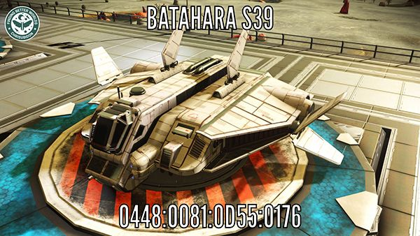

# NSM-Discovr-Workflow
A No Man's Sky Discovery Workflow to imprint screenshots of your discoveries with valuable information like name, address and a watermark. Based on "Overlay Image" Workflow by @jordanmerrick
# About
This Workflow is an Action Extension for iOS. Use photo mode and Playstation's Share Button to screenshot your No Man's Sky discovery. From the Photos app select the screenshot and share it to this extension to add discovery name, system address and a watermark to the final image. Make it easy for other people to find your discovery!
# Install
- Get Workflow app for iOS: http://workflow.is/
- Click this link: https://t.co/Mg1DHrXwrG
- or download the Discovr.wflow file and add it manually
# Watermark
To add a watermark save your logo as iCloudDrive/Workflow/Watermark.png
# Example
   
You can find the Batahara S39 at EUCLID:0448:0081:0D55:0176 in No Man's Sky.
